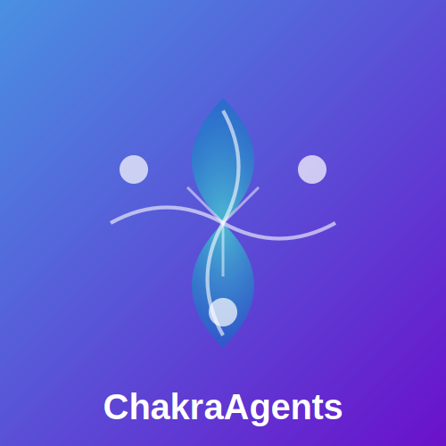
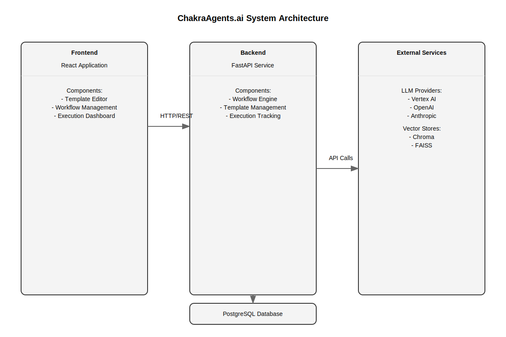

# ChakraAgents.ai

<div align="center">
  
  <h3>Agentic AI as a Service</h3>
  <p>Create, test, and deploy powerful AI agent workflows with easy API integration</p>
  
  [](https://opensource.org/licenses/MIT)
  [](https://github.com/sudsk/ChakraAgents.ai/stargazers)
  [](https://github.com/sudsk/ChakraAgents.ai/issues)
  [](https://www.python.org/downloads/)
  [](https://fastapi.tiangolo.com/)
</div>

---

## What is ChakraAgents.ai?

ChakraAgents.ai is a platform for creating, testing, and deploying AI agent workflows built with LangChain and LangGraph. It enables you to:

1. **Build agent workflows** using a visual interface
2. **Connect to your private data** through RAG capabilities
3. **Test and refine** your workflows
4. **Deploy as API endpoints** for seamless integration
5. **Monitor performance** and usage

What makes ChakraAgents.ai special is its focus on agentic decision-making combined with easy API deployability. Create powerful AI agents that can work with your data and integrate them into your applications without complex coding.

## Architecture

ChakraAgents.ai supports three core agent architectures:

### 1. Supervisor Architecture

A hierarchical workflow where a supervisor agent coordinates specialized worker agents.

<div align="center">
  
</div>

**When to use:** Complex workflows requiring orchestration, multi-step reasoning, or specialized worker agents.

### 2. Swarm Architecture

A collaborative system where multiple agents work together as peers.

<div align="center">
  
</div>

**When to use:** Problems that benefit from multiple perspectives, collective reasoning, or different expertise areas.

### 3. RAG Architecture

A knowledge-enhanced agent that can analyze and reason about your private data.

<div align="center">
  
</div>

**When to use:** When you need to query private data, synthesize information, or combine world knowledge with your documents.

**Note:** RAG capabilities can be enabled for any agent in any architecture.

## System Architecture

ChakraAgents.ai consists of:

<div align="center">
  
</div>

1. **Frontend**: React application with Chakra UI components
2. **Backend**: FastAPI service with LangChain/LangGraph integration
3. **API Gateway**: For client application integration
4. **Vector Store**: For document search and RAG capabilities
5. **LLM Providers**: Integration with Vertex AI, OpenAI, Anthropic

## Installation

### Prerequisites

- Python 3.10+
- Node.js 16+
- PostgreSQL (for production)
- Docker (optional)

### Backend Setup

```bash
# Clone the repository
git clone https://github.com/sudsk/ChakraAgents.ai.git
cd ChakraAgents.ai/backend

# Create and activate a virtual environment
python -m venv venv
source venv/bin/activate  # On Windows: venv\Scripts\activate

# Install dependencies
pip install -r requirements.txt

# Copy environment variables example and configure
cp .env.example .env
# Edit .env with your configuration

# Run database migrations
alembic upgrade head

# Start the backend server
uvicorn app.main:app --reload
```

### Frontend Setup

```bash
# Navigate to the frontend directory
cd ../frontend

# Install dependencies
npm install

# Copy environment variables example and configure
cp .env.example .env
# Edit .env with your configuration

# Start the development server
npm start
```

### Docker Setup

```bash
# Build and start all services
docker-compose up -d

# Stop all services
docker-compose down
```

## Usage Guide

### Creating a Workflow

1. **Select a Template**: Start with a pre-built template or create your own
2. **Choose an Architecture**: Supervisor, Swarm, or RAG
3. **Configure Agents**: Define roles, models, and prompt templates
4. **Enable RAG**: Connect to your documents if needed
5. **Save Your Workflow**: For later use and deployment

<div align="center">
  
</div>

### Testing Your Workflow

1. **Open Test Console**: Go to your workflow page
2. **Enter Test Input**: Provide a sample query
3. **Run Workflow**: Execute the workflow
4. **View Results**: See agent interactions and results
5. **Refine as Needed**: Adjust configurations based on test results

<div align="center">
  
</div>

### Deploying as API

1. **Go to Deployments**: Access the deployments page
2. **Create Deployment**: Select your workflow
3. **Configure API**: Set version and description
4. **Get API Key**: Copy your API key for authentication
5. **View Integration Examples**: See code samples for different languages

<div align="center">
  
</div>

### Integrating in Your Application

**JavaScript Example**

```javascript
const executeWorkflow = async (query) => {
  const response = await fetch('https://your-api.chakraagents.ai/api/v1/workflows/your-workflow-id/execute', {
    method: 'POST',
    headers: {
      'Content-Type': 'application/json',
      'Authorization': 'Bearer your-api-key'
    },
    body: JSON.stringify({
      input_data: {
        query: query
      }
    })
  });
  
  return await response.json();
};

// Example usage
const result = await executeWorkflow('How can I improve customer retention?');
console.log(result);
```

**Python Example**

```python
import requests

def execute_workflow(query):
    url = 'https://your-api.chakraagents.ai/api/v1/workflows/your-workflow-id/execute'
    headers = {
        'Content-Type': 'application/json',
        'Authorization': f'Bearer your-api-key'
    }
    payload = {
        'input_data': {
            'query': query
        }
    }
    
    response = requests.post(url, headers=headers, json=payload)
    return response.json()

# Example usage
result = execute_workflow('How can I improve customer retention?')
print(result)
```

## Use Cases

### 1. Customer Support Enhancement

Create agents that can access your knowledge base, respond to customer inquiries, and escalate when needed.

### 2. Research Automation

Build research agents that can analyze documents, synthesize information, and generate insights.

### 3. Personalized Recommendations

Deploy agents that understand user preferences and provide tailored recommendations from your catalog.

### 4. Data Analysis Assistant

Create agents that can analyze your data, generate reports, and answer business questions.

### 5. Content Generation

Build workflows that can generate blog posts, product descriptions, or marketing copy aligned with your brand.

## Advanced Features

### Document Management

Upload and manage various document types for RAG capabilities:

- PDF documents
- CSV data files
- Text documents
- Markdown files

### Webhook Integration

Configure webhooks to notify your systems when workflows complete:

```javascript
// Example webhook receiver
app.post('/api/workflow-completed', (req, res) => {
  const { execution_id, status, result } = req.body;
  
  if (status === 'completed') {
    // Process results
    updateDatabase(result);
    notifyUser(result);
  } else {
    // Handle failure
    logError(execution_id, result.error);
  }
  
  res.status(200).send('Webhook received');
});
```

### Usage Analytics

Monitor your workflow performance with detailed analytics:

- Request volume
- Success rate
- Response time
- Token usage
- Cost estimates

## API Reference

### Authentication

All API requests require a Bearer token:

```
Authorization: Bearer your-api-key
```

### Core Endpoints

| Endpoint | Method | Description |
|---|---|---|
| `/api/v1/workflows/{workflow_id}/execute` | POST | Execute a workflow |
| `/api/v1/deployments/{deployment_id}/status` | GET | Check deployment status |

### Request Format

```json
{
  "input_data": {
    "query": "Your query here",
    "additional_parameters": "As needed"
  }
}
```

### Response Format

```json
{
  "execution_id": "uuid",
  "status": "completed",
  "result": {
    "success": true,
    "execution_time": 1.24,
    "messages": [
      {"role": "user", "content": "Your query"},
      {"role": "assistant", "content": "Response from the workflow"}
    ],
    "outputs": {
      "agent1": "Output from agent 1",
      "agent2": "Output from agent 2"
    }
  }
}
```

## Deployment

### Google Cloud Platform

```bash
# Navigate to deployment directory
cd deployment

# Edit deployment configuration
cp config.example.yaml config.yaml
# Edit config.yaml with your settings

# Run deployment script
./deploy-gcp.sh
```

### AWS

```bash
# Navigate to deployment directory
cd deployment

# Edit deployment configuration
cp config.example.yaml config.yaml
# Edit config.yaml with your settings

# Run deployment script
./deploy-aws.sh
```

### Kubernetes

```bash
# Navigate to deployment directory
cd deployment/kubernetes

# Apply Kubernetes manifests
kubectl apply -f namespace.yaml
kubectl apply -f configmap.yaml
kubectl apply -f secrets.yaml
kubectl apply -f deployment.yaml
kubectl apply -f service.yaml
kubectl apply -f ingress.yaml
```

## Contributing

We welcome contributions to ChakraAgents.ai! Please check out our [Contributing Guide](CONTRIBUTING.md) for guidelines on how to proceed.

### Development Setup

Follow these steps to set up your development environment:

1. Fork the repository
2. Clone your fork
3. Create a feature branch
4. Make your changes
5. Run tests
6. Submit a pull request

## License

This project is licensed under the MIT License - see the [LICENSE](LICENSE) file for details.

## Acknowledgments

- [LangChain](https://github.com/langchain-ai/langchain) for the foundational agent framework
- [LangGraph](https://github.com/langchain-ai/langgraph) for the agent orchestration capabilities
- [Chakra UI](https://chakra-ui.com/) for the frontend components
- All our [contributors](https://github.com/sudsk/ChakraAgents.ai/graphs/contributors) and supporters

---

<div align="center">
  <p>Built with ❤️ by <a href="https://github.com/sudsk">Suds Kumar</a> and the ChakraAgents.ai Team</p>
  <p>
    <a href="https://twitter.com/ChakraAgents">Twitter</a> •
    <a href="https://discord.gg/chakraagents">Discord</a> •
    <a href="https://chakraagents.ai">Website</a>
  </p>
</div>
